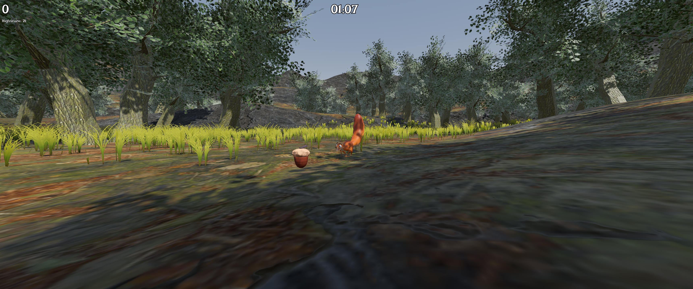

# Nutty for nuts

Help Nutty the squirrel grab as many nuts as you can to prepare for the winter, do this before the time runs out!  

## Assets used

### Art

[Squirrel by Kovonic](https://sketchfab.com/3d-models/squirrel-f442c20ca7dd4a988a17a12604556672) edited by [ShadowXPA](https://shadowxpa.github.io)  
[Acorn by ShadowXPA](https://shadowxpa.github.io)  
[Tree by ShadowXPA](https://shadowxpa.github.io)  
[Branch and bark textures by CG Geek](https://www.youtube.com/watch?v=y7PdiGXbrD0)  
[Grass from Proton Scatter demo](https://github.com/HungryProton/scatter)  
[Ground037 by ambientCG](https://ambientcg.com/a/Ground037)  
[Ground068 by ambientCG](https://ambientcg.com/a/Ground068)  
[Rock030 by ambientCG](https://ambientcg.com/a/Rock030)  
[Prototype Textures by Kenney](https://kenney.nl/assets/prototype-textures)  
[UI Pack - Adventure by Kenney](https://kenney.nl/assets/ui-pack-adventure)

### Font

[Irish Grover (Google Fonts)](https://fonts.google.com/specimen/Irish+Grover)

### Music

[journey by chajamakesmusic](https://chajamakesmusic.itch.io/cute-and-silly-rpg-music-pack)

### Sound effects

[jingles_STEEL16 by Kenney](https://kenney.nl/assets/music-jingles)  
[Birds 04 by dibko](https://freesound.org/people/dibko/sounds/624125/)  
[Footstep_Grass_5 by GiocoSound](https://freesound.org/people/GiocoSound/sounds/421135/)

## Controls

### Desktop

Use the `WASD` buttons to move. `Mouse` to control the camera. `Space` to jump (not that you really need it...).  

### Mobile

Use the `left side` of the screen to move. `Right side` of the screen to move the camera. `Button` on the bottom right of the screen to jump.  

## Installation

Head to the [Releases](https://github.com/ShadowXPA/Sciuridae/releases/latest) tab and download the latest version available.  

### Linux

Run the `Nutty.x86_64`.  

### Windows

Run the `Nutty.exe`.  

### Android

You might need to allow `Install unknown apps` from your settings.  
Install the `.apk`.  
You may also need to press `Install anyway` when shown, it might also show an `Unknown developer` prompt. (Thanks Google...)  

### macOS, iOS

Build it yourself.  

## Future work/Ideas

- Better movement  
- More squirrels  
  - Each with different stats  
- More levels  
- Better performance  
